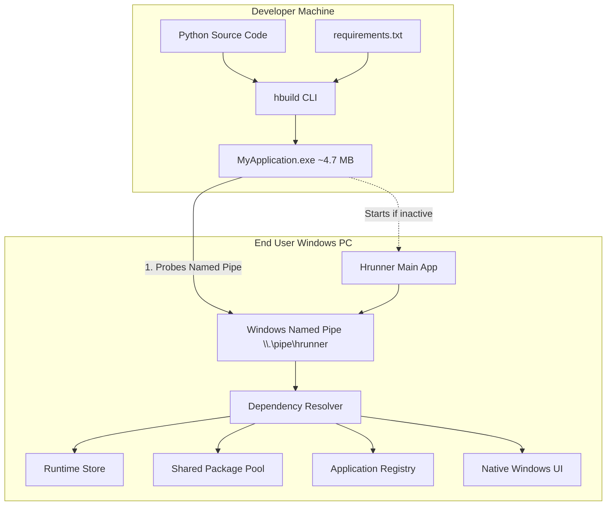
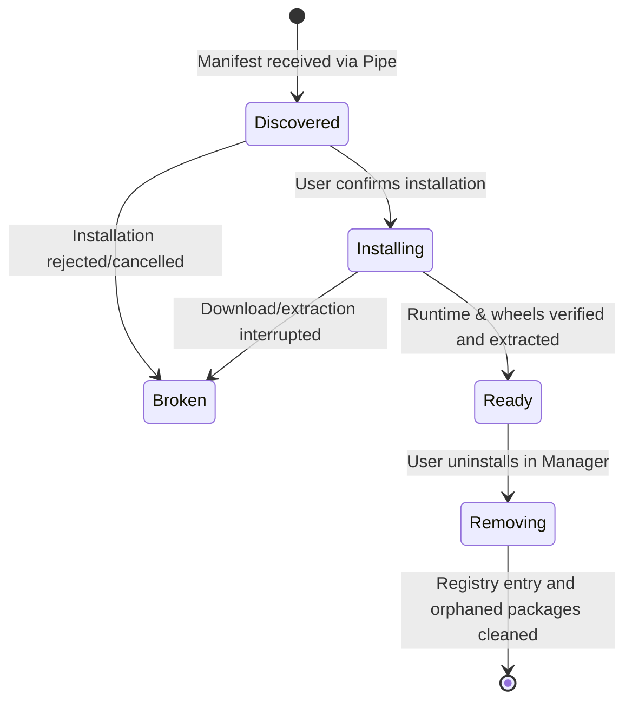

# Hrunner Architecture

This document details the architectural design and system boundaries of Hrunner.

---

## 1. System Overview

Hrunner decouples desktop Python applications from the heavy Python interpreter and third-party dependencies.

Traditional bundling tools (such as PyInstaller) duplicate the entire runtime, standard library, C-runtimes, and packages into every single executable. Hrunner distributes applications as ultra-compact native Go launchers (~4.7 MB) containing only the application code and a versioned manifest.



---

## 2. Core Components

### 2.1 Hrunner Main App (`cmd/hrunner`)
* **Distribution**: Installed via NSIS setup (`dist/HrunnerSetup.exe`) into `%LOCALAPPDATA%\Programs\Hrunner`.
* **Discovery Registry Keys**:
  * `HKCU\Software\Hrunner\InstallPath`
  * `HKCU\Software\Microsoft\Windows\CurrentVersion\App Paths\hrunner.exe`
* **On-Demand Lifecycle**:
  * Listens on Windows Named Pipe `\\.\pipe\hrunner`.
  * NOT a persistent background service or startup daemon.
  * Starts when a Hrunner application launches.
  * Tracks active client connections.
  * Shuts down automatically after 5 seconds of idle inactivity when no applications are open.

### 2.2 Hrunner Builder (`cmd/hbuild`)
* Developer-side CLI tool.
* Analyzes Python projects and parses `requirements.txt` / `pyproject.toml`.
* Generates versioned `manifest.json`.
* Packages source files into a ZIP payload.
* Appends payload as a PE overlay to the prebuilt Go launcher stub (`hlauncher.exe`).
* Produces standalone executables in under 10 milliseconds.

### 2.3 Application Launcher (`cmd/hlauncher`)
* Minimal native Go executable (~4.7 MB).
* Discovers installed Hrunner via Registry, App Paths, or adjacent paths.
* Spawns `hrunner.exe --pipe-server` if not running.
* Sends `LaunchRequest` over `\\.\pipe\hrunner`.
* Awaits `LaunchReady` with runtime paths and application-specific package paths.
* Spawns the isolated Python process and proxies exit codes.

---

## 3. Storage Layout

All centrally managed assets reside under `%LOCALAPPDATA%\Hrunner`:

```text
%LOCALAPPDATA%\Hrunner\
├── bin\
│   └── hrunner.exe              # Main application binary
├── runtimes\
│   ├── python-3.12.8\           # Extracted official embeddable Python
│   └── python-3.13.7\           # Multi-version coexistence
├── packages\
│   ├── requests\
│   │   └── 2.32.5\              # Immutable shared package version
│   ├── numpy\
│   │   ├── 1.26.4\              # Coexisting versions
│   │   └── 2.3.2\
│   └── pillow\
│       └── 11.3.0\
├── applications\                # Application-specific state
├── cache\                       # Downloaded .whl and Python .zip archives with SHA-256
└── registry.json                # Application registry and state machine
```

---

## 4. Application Lifecycle State Machine

Hrunner tracks every application across formal states:



---

## 5. Security & Isolation Model

* **No Network Listeners**: Hrunner does not bind any TCP port or expose localhost networking. All IPC uses Windows Named Pipes with current-user DACL restrictions.
* **Integrity Checking**: All runtime and wheel downloads are validated with SHA-256 digests against official PyPI metadata.
* **Atomic Installation**: Extractions occur in temporary staging folders (`tmp_<name>_<timestamp>`) and commit via atomic directory rename. Interrupted downloads leave zero corrupted files in the package pool.
* **Immutability**: Once installed, package version directories are treated as read-only.
