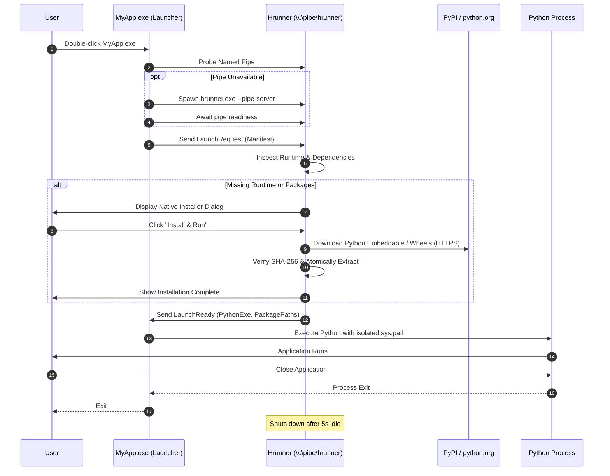

# How Hrunner Works

This document explains the runtime flow when an application packaged with Hrunner is launched on an end user's machine.

---

## 1. Step-by-Step Flow



---

## 2. Launch Sequence Details

### Step 1: Payload Inspection
When `MyApp.exe` starts, it reads its own executable file. At the end of the file (in the PE overlay), it discovers the appended application ZIP archive containing `manifest.json` and the packaged `.py` files. It extracts the application code to a local cache directory: `%TEMP%\hrunner_app_<appID>_<version>`.

### Step 2: Hrunner Discovery
The launcher tests for an active Named Pipe at `\\.\pipe\hrunner`. If unavailable, it discovers the installed Hrunner executable using:
1. Windows Registry: `HKCU\Software\Hrunner\InstallPath` (written by the NSIS installer)
2. Windows Registry: `HKCU\Software\Microsoft\Windows\CurrentVersion\App Paths\hrunner.exe`
3. Default installation path: `%LOCALAPPDATA%\Programs\Hrunner\hrunner.exe`
4. Adjacent path or system PATH

If Hrunner is not installed on the system, the launcher displays a native Windows dialog:
```text
Hrunner is required
This application requires Hrunner to run.
[ Install Hrunner ]    [ Cancel ]
```

### Step 3: Launch Request
Once connected, the launcher sends a versioned `LaunchRequest` containing:
* Application ID, Name, and Version
* Requested Python version (e.g. `3.13.7`)
* Flag `allow_compatible_python`
* Map of direct pinned dependencies (e.g. `{"requests": "2.32.5", "pillow": "11.3.0"}`)
* Entrypoint script (e.g. `main.py`)

### Step 4: Resolution & First-Launch Experience
Hrunner checks:
1. Is Python 3.13.7 in `%LOCALAPPDATA%\Hrunner\runtimes`?
2. Are all required packages and their transitive dependencies in `%LOCALAPPDATA%\Hrunner\packages`?

If anything is missing, Hrunner calculates the exact total download size and presents a native Windows `TaskDialog`:
```text
My Application
This application requires:
  • Python 3.13.7
  • requests 2.32.5 (2.8 MB)
  • pillow 11.3.0 (9.4 MB)

Total Download Size: 27.2 MB
[ Install & Run ]    [ Cancel ]
```

### Step 5: Verified Installation
Upon user approval:
1. Missing Python embeddable zip is downloaded from `python.org` and extracted into `runtimes/python-<version>`.
2. Missing wheels are downloaded from PyPI, verified against SHA-256 hashes, and extracted into `packages/<name>/<version>`.
3. Application state in `registry.json` transitions to `ready`.
4. The user is shown:
```text
Installation Complete
My Application has been installed successfully.
[ Launch Application ]    [ Finish ]
```

### Step 6: Isolated Execution
Hrunner returns a `LaunchReady` message with:
* The absolute path to `python.exe`
* An ordered list of package store directories to inject into `sys.path`
* The application entrypoint

The launcher generates an in-memory bootstrap snippet that prepends only the requested package directories and the application directory to `sys.path`, adds DLL directories via `os.add_dll_directory` for native extensions (`.pyd`), and runs the entrypoint.

### Step 7: Automatic Shutdown
When the application exits, the client pipe closes. Hrunner decrements its active client counter. When no applications are active and the Manager window is closed, Hrunner terminates cleanly after a 5-second idle timeout.
