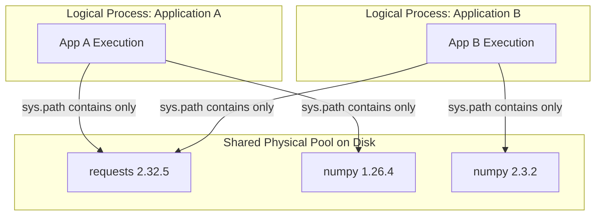

# Logical Environment Isolation

In Hrunner, **Physical Sharing** and **Logical Isolation** are strictly separated.

---

## 1. The Isolation Problem

In traditional shared environments (such as a global `site-packages` directory):
* Installing a newer version of a library for App B can break App A.
* Python allows only one version of a module in `sys.path` at a time.
* DLL conflicts between C-extensions create instability.

---

## 2. How Hrunner Solves This

Hrunner physically stores shared packages in an immutable central pool, but logically isolates each application when executed.

### The Isolation Bootstrap Mechanism
When launching an application:
1. Hrunner resolves the exact list of package pool directories required by that application's manifest.
2. The Go launcher constructs a tailored Python bootstrap script that:
   * Sets `sys.path` to include **only** the application directory and the application's specific package pool paths.
   * Calls `os.add_dll_directory(path)` for each package directory on Windows Python 3.8+ to resolve native `.pyd` dependencies.
   * Invokes the entrypoint using `runpy.run_path(entrypoint, run_name='__main__')`.
3. The process runs in full isolation without reading packages requested by other applications.
